

	

<h1 align="center" style="margin: 30px 0 30px; font-weight: bold;">智碳光伏管理系统</h1>

基于若依框架前后端分离版本

## 平台简介

智碳光伏发电监测管理系统，基于Spring Boot + Vue前后端分离版本。是一种基于物联网、大数据及云计算技术的智能化管理平台，用于实时监控、分析和优化光伏电站的运行状态，旨在提升发电效率、保障系统安全、降低运维成本，并为电站的长期稳定运行提供数据支持。

* 前端采用Vue、Element UI。
* 后端采用Spring Boot、Spring Security、Redis & Jwt。
* 权限认证使用Jwt，支持多终端认证系统。
* 支持加载动态权限菜单，多方式轻松权限控制。
* 高效率开发，使用代码生成器可以一键生成前后端代码。

## 内置功能

### 1. 实时监测
#### 1.1 实时数据
#### 1.2 电站实时状态
#### 1.3 设备实时状态
### 2. 统计分析
#### 2.1 电站发电统计
#### 2.2 设备发电统计
#### 2.3 同比分析
#### 2.4 环比分析
### 3. 尖峰平谷
#### 3.1 图表统计
#### 3.2 报表统计
### 4. 电能质量
#### 4.1 负荷分析
#### 4.2 三相不平衡分析
#### 4.3 功率因数分析
### 5. 智能报警
### 6. 运维管理
#### 6.1 电站管理
#### 6.2 设备管理
#### 6.3 设备类型管理
#### 6.4 设备点检
#### 6.5 备品备件
#### 6.6 峰平谷配置
### 7. 移动端（小程序）
#### 7.1 首页概览
#### 7.2 实时监测
#### 7.3 智能报警

## UI展示

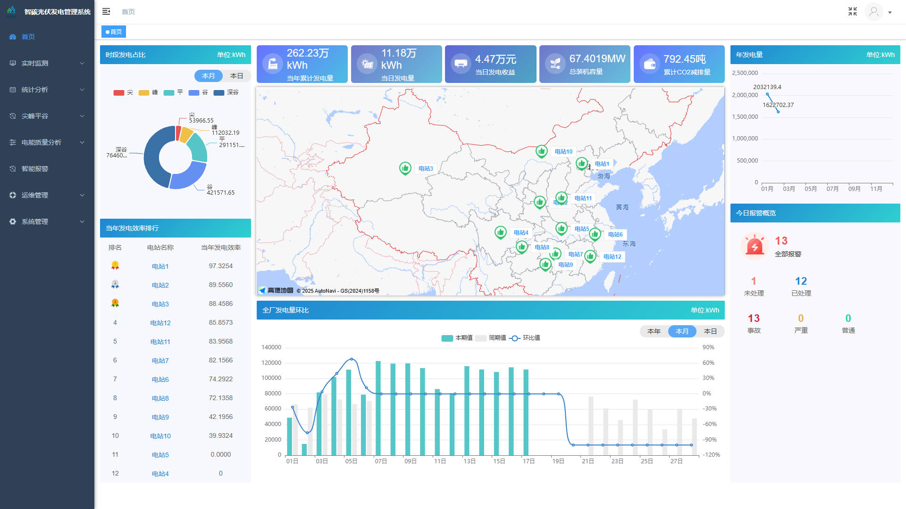
    首页

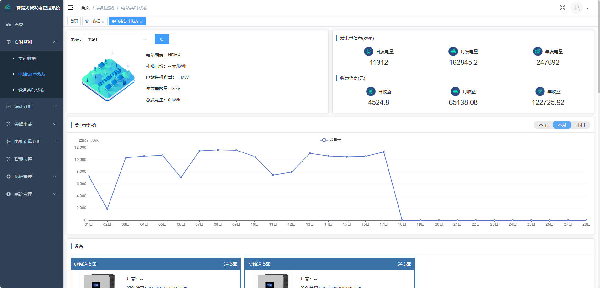
    电站实时状态 

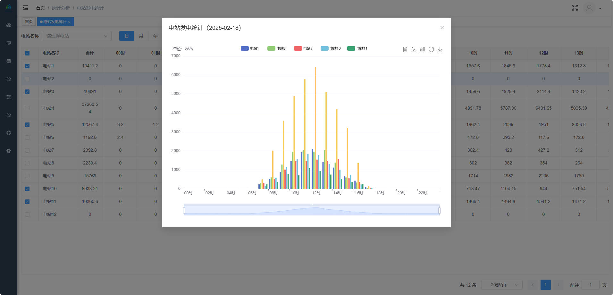
    电站发电统计
 
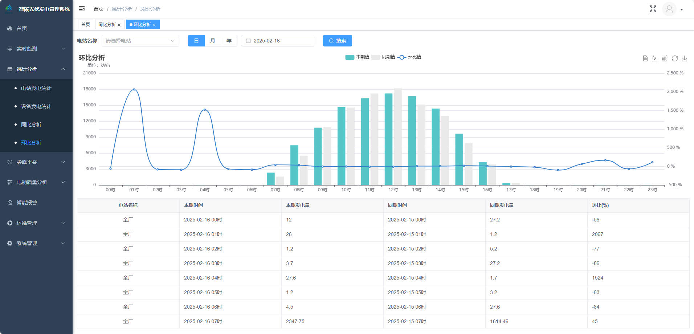
    环比分析 

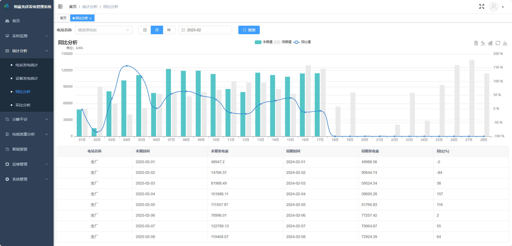
    同比分析 

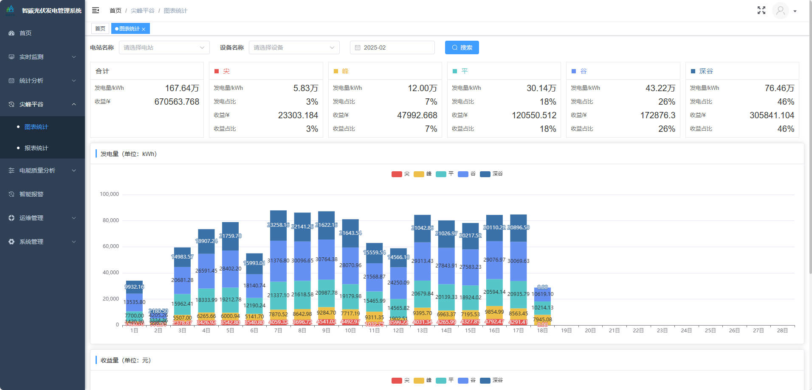
    峰平谷分析 

    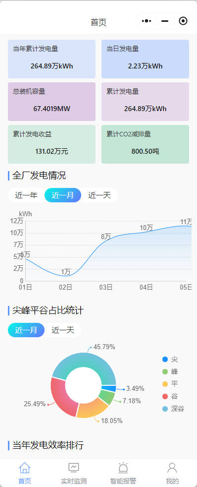
    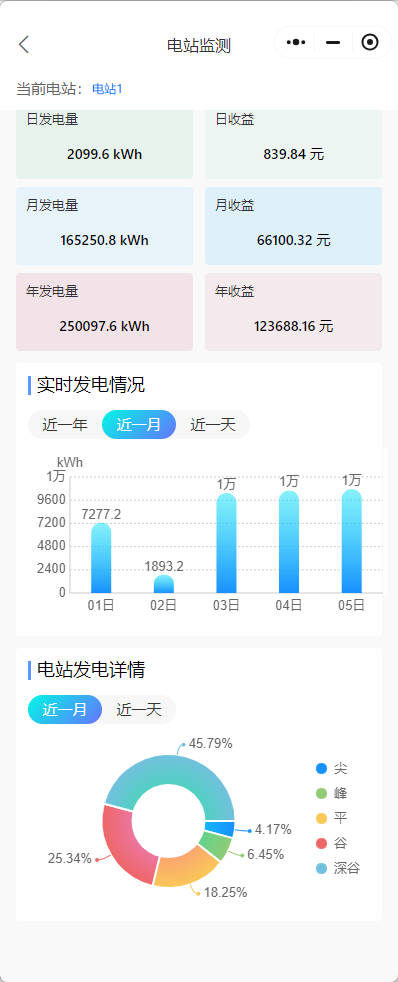

    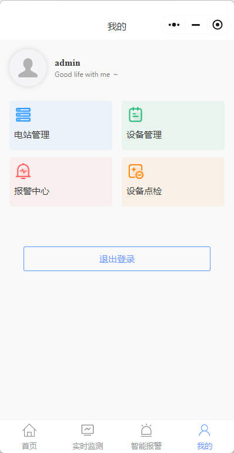
    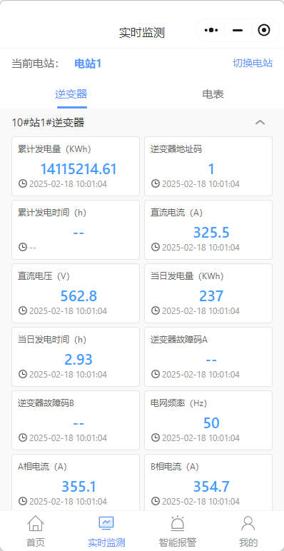
    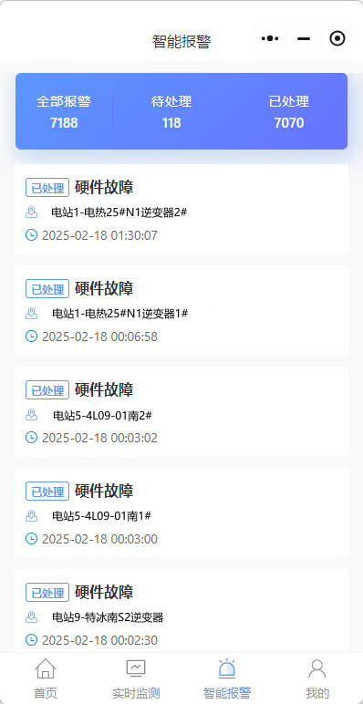>

    小程序

- guestUser/guest@123456

演示地址：  

## 快速启动（后端）

请参考升级前基线文档：`docs/BASELINE.md`。

补充说明：
- dev profile 默认使用 H2 内存库启动（端口 9050）。
- 如需使用 MySQL，请按 `docs/BASELINE.md` 准备数据库并执行初始化 SQL。
- H2 Console（仅 dev）：`http://localhost:9050/h2-console`。

## 快速启动（后端）

请参考升级前基线文档：`docs/BASELINE.md`。

补充说明：
- dev profile 默认使用 H2 内存库启动（端口 9050）。
- 如需使用 MySQL，请按 `docs/BASELINE.md` 准备数据库并执行初始化 SQL。
- H2 Console（仅 dev）：`http://localhost:9050/h2-console`。

## 生产环境变量清单（必读）

`application-prod.yml` 已将敏感配置外置为环境变量。生产部署时请在启动前注入以下变量：

| 变量名 | 用途 | 必填 | 示例 |
|---|---|---|---|
| `PROD_DB_USERNAME` | MySQL 主库账号 | 是 | `pv_admin` |
| `PROD_DB_PASSWORD` | MySQL 主库密码 | 是 | `S3cure-DB-Pass` |
| `PROD_REDIS_PASSWORD` | Redis 密码 | 是（启用鉴权时） | `S3cure-Redis-Pass` |
| `PROD_REDIS_USERNAME` | Redis ACL 用户名 | 否 | `default` |
| `PROD_REDIS_HOST` | Redis 地址 | 否 | `redis.internal` |
| `PROD_REDIS_PORT` | Redis 端口 | 否 | `6379` |
| `PROD_REDIS_DATABASE` | Redis DB 索引 | 否 | `0` |
| `PROD_TOKEN_SECRET` | JWT/Token 签名密钥 | 是 | `change-me-to-long-random-secret` |
| `PROD_DRUID_LOGIN_USERNAME` | Druid 控制台账号 | 是 | `ops_admin` |
| `PROD_DRUID_LOGIN_PASSWORD` | Druid 控制台密码 | 是 | `S3cure-Druid-Pass` |
| `PROD_WX_APPID` | 微信小程序 appid | 是 | `wx1234567890abcdef` |
| `PROD_WX_SECRET` | 微信小程序 secret | 是 | `wx-secret-value` |
| `PROD_WX_TOKEN` | 微信 token | 是 | `wx-token-value` |
| `PROD_WX_ENCODING_AES_KEY` | 微信消息加密 key | 是 | `43charsEncodingAesKeyExample...` |
| `PROD_WX_PAGE` | 微信订阅消息跳转页 | 是 | `pages/index/index` |
| `PROD_WX_TEMPLATE_ID` | 微信模板 ID | 是 | `tmpl_xxx` |
| `PROD_WX_ENV_VERSION` | 微信环境版本 | 否 | `release` |
| `PROD_INFLUXDB_TOKEN` | InfluxDB 访问令牌 | 是 | `influxdb-token-value` |
| `PROD_INFLUXDB_HOST` | InfluxDB 地址 | 否 | `http://influxdb:8086` |
| `PROD_INFLUXDB_ORG` | InfluxDB 组织 | 否 | `pv` |
| `PROD_INFLUXDB_BUCKET` | InfluxDB bucket | 否 | `pvdata` |
| `PROD_INFLUXDB_MEASUREMENT` | InfluxDB measurement | 否 | `pv` |

> 启动前提示：对必填敏感项使用了 `${ENV_VAR}`（无默认值）。若缺失，Spring 会在启动阶段直接报 `Could not resolve placeholder`，可快速定位缺失变量。

## 沟通交流

扫码添加微信交流，加微信请备注：pv。

  
  

